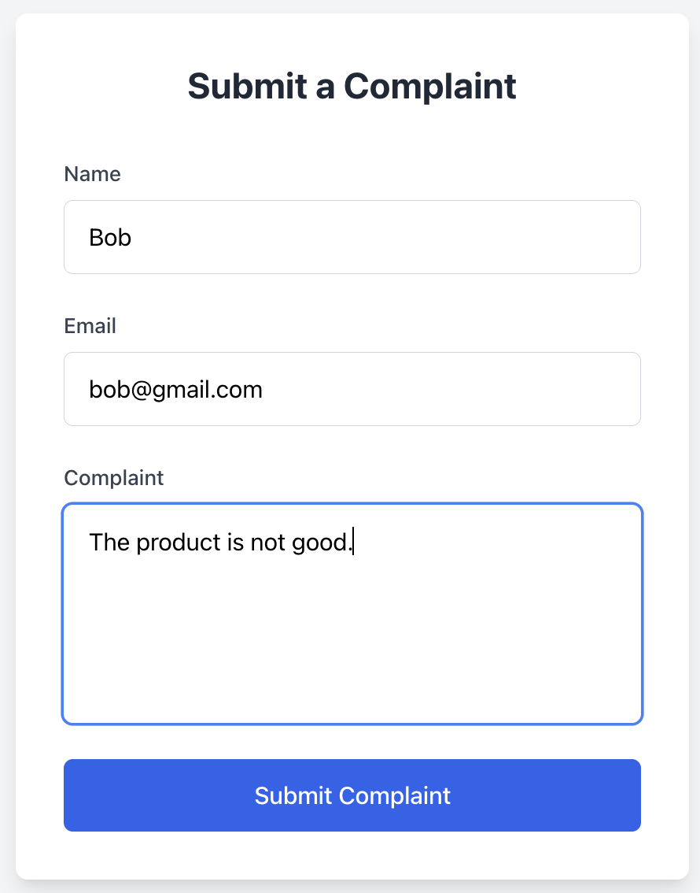
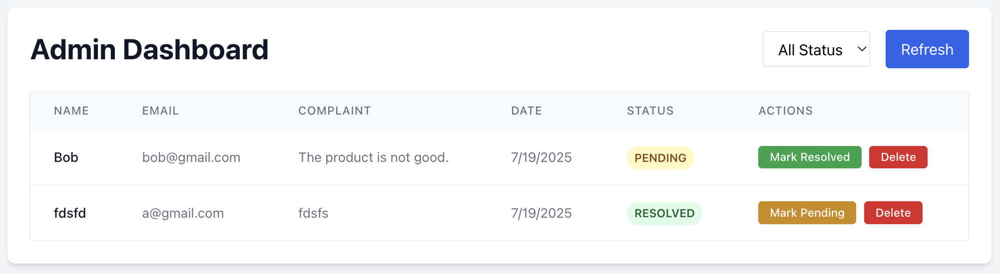

# Complaint Management System

A full-stack application for submitting and managing complaints.

Screenshot of complaint form submission page:

<p align="center">
  
</p>

Screenshot of admin page:

<p align="center">
  
</p>

### Tech Stack

- **Frontend**: React + TypeScript + Vite + Tailwind CSS
- **Backend**: Node.js + Express + TypeScript
- **Database**: Supabase (PostgreSQL)

I also tested my API endpoints using Postman.

## Setup Instructions

You will need Node.js, npm, and a Supabase account.

### 1. Clone the Repository

```bash
git clone <your-repo-url>
cd take_home
```

### 2. Set Up Supabase Database

#### Create Supabase Project
1. Sign up/Login to [supabase.com](https://supabase.com)
3. Click "New Project". You can create a new organization.
5. Enter project details, like this example:
   - **Name**: `complaint-management-system`
   - **Database Password**: Create a password.
   - **Region**: Choose a region.
6. Click "Create new project"

#### Get API Keys
1. In your Supabase dashboard, go to **Settings** → **API**
2. Copy these values for the .env files later:
   - **Project URL** (looks like: `https://abcdefghijklmnop.supabase.co`)
   - **anon public** key (starts with `eyJ...`)

#### Create Database Table
First, create a new custom enum type `public.complaint_status` that has two values: PENDING and RESOLVED.
Then:
1. Go to **SQL Editor** in your Supabase dashboard
2. Click **New Query**
3. Paste and run this SQL:

```sql
-- Create complaints table
create table public.complaints (
  id bigint generated by default as identity not null,
  submission_date date not null,
  name text not null,
  email text not null,
  complaint text not null,
  status public.complaint_status not null default 'PENDING'::complaint_status,
  constraint complaints_pkey primary key (id)
) TABLESPACE pg_default;
```

Disable row level security, since for this demo, all operations are allowed.
Otherwise, Supabase will recognize that there are no row-level policies set and won't work as expected.

### 3. Configure Environment Variables

#### Backend Configuration
Create `backend/.env`:
```bash
PORT=(desired backend port, 5002 works for me)
SUPABASE_URL=https://your-project-id.supabase.co
SUPABASE_ANON_KEY=your-anon-key-here
```

#### Frontend Configuration
Create `frontend/.env`:
```bash
VITE_BACKEND_PORT=(must be the same backend port as above)
```

### 4. Install Dependencies

```bash
# Backend dependencies
cd backend
npm install

# Frontend dependencies  
cd ../frontend
npm install
```

### 5. Start the Application

```bash
# Start backend (in backend directory)
cd backend
npm run dev

# Start frontend (in frontend directory, new terminal)
cd frontend
npm run dev
```

### 6. Access the Application

Visit the following URLs:
(Note: 5173 is the default port of the Vite server, but you may replace it with a different port.)

- **Submit complaints**: `http://localhost:5173/submit`
- **Admin dashboard**: `http://localhost:5173/admin`
- **Backend API**: `http://localhost:[your-backend-port]}`

## API Endpoints

- `GET /complaints` - Get all complaints
- `POST /complaints` - Create a new complaint
- `PATCH /complaints/:id` - Toggle complaint status (Pending, Resolved)
- `DELETE /complaints/:id` - Delete a complaint

## Assumptions and tradeoffs
- A single user could file as many complaints as they want, which could break the system (overload the servers/database). In development, I would set limits per users and make sure too many API requests are not sent within a certain time limit.
- Anyone can access the admin dashboard by visiting /admin. It assumes users won't abuse the system by visiting that API route.
- The email field validation only checks simple syntax rules, like whether '@' is included, but doesn't check if this is actually a valid user address.
- The system doesn't check whether the user writing a complaint has even used the product/service that they are writing a complaint for. When applied to a use case, we would want to store this data.
- When we need to store a lot of data, Supabase free tier won't be enough. We might host the database on a more scalable cloud service like AWS instead.
- Both backend and frontend have to run locally.

## What I would improve with more time
- Add authentication and access control to the admin dashboard
- Implement rate limiting to prevent spam by users filing too many complaints
- Validate email addresses more robustly (I'm sure there are libraries for this)
- Associate complaints with verified users/customers
- Deploy to a cloud environment for scalability
